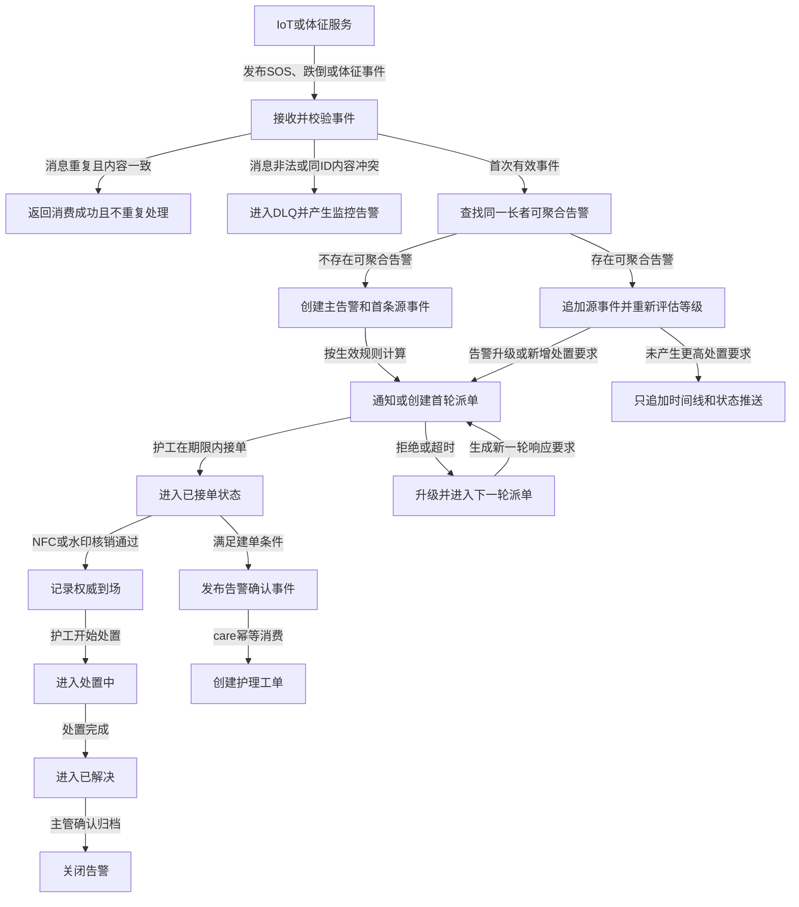

# alert-service 安全预警服务首期需求分析文档

> 版本：v1.0（首期）  
> 服务：`service-alert`  
> 业务级别：P0，人身安全处置链路  
> 需求基线：`docs/alert-service-开发设计文档.md` v3.3  
> 配套设计：`docs/alert-service-数据库表字段设计.md` v2.2

## 1. 文档目的

本文从业务视角定义安全预警服务首期必须解决的问题、参与角色、功能范围、业务规则、异常处理和验收标准，作为产品、前端、后端、测试及上下游服务联调的共同基线。

本文描述“系统必须做什么”，不约束 Controller、Mapper、缓存结构等代码实现细节；具体技术方案以配套开发设计文档为准。

## 2. 业务背景

养老场景中的 SOS、跌倒和体征异常具有以下特点：

- 同一事故可能由按钮、跌倒设备和体征设备先后或同时报告。
- 告警需要在较短时间内完成通知、派单、接单、到场和处置。
- MQ、网络和客户端可能重试，系统不能因此重复建告警、重复派单或重复创建工单。
- 告警过程关系人身安全，必须保留可追溯、可验真的处置证据。
- 屏幕、声光设备和摄像头可能不可用，但硬件失败不能阻塞人工处置主链路。
- WebSocket 能提升实时体验，但断网客户端仍需通过查询接口恢复权威状态。

首期建设目标是形成可靠、可追踪的告警闭环，而不是一次建设完整的告警运营平台。

## 3. 业务目标与成功标准

### 3.1 业务目标

1. 可靠接收 SOS、跌倒、体征瞬时超阈值和体征趋势事件。
2. 将同一长者、同一事故窗口内的相关信号聚合为一个处置告警，同时保留每条源事件证据。
3. 按规则确定告警类型、等级、响应时限、派单范围和联动动作。
4. 支持护工接单、拒绝、到场核销、处置、关闭以及系统超时升级。
5. 向护工端、管理端和其他授权终端实时同步告警状态。
6. 在满足条件时通知护理服务创建正式工单，并向 IoT 服务发布硬件联动意图。
7. 保证告警全生命周期可查询、可审计、可验证，异常篡改能够被发现。

### 3.2 首期成功标准

| 编号 | 成功标准 |
|---|---|
| SC-01 | 同一 MQ 事件重复投递不会重复创建告警或产生重复外部效果。 |
| SC-02 | 同一长者的心率异常与 SOS 并发到达时，只形成一个主告警并保留两条源事件。 |
| SC-03 | 多名护工并发接单时最多一人成功。 |
| SC-04 | 告警超时后能够自动升级，不会因多实例调度而重复升级。 |
| SC-05 | 数据库已经提交的通知、工单和硬件意图最终能够被发布。 |
| SC-06 | WebSocket 断线或漏消息后，客户端能够通过 HTTP 查询恢复最新状态。 |
| SC-07 | 到场挑战值不能被重复使用，核销成功和失败都有审计记录。 |
| SC-08 | 关键告警数据被绕过应用直接修改后，系统能够发现验签失败并告警。 |

## 4. 首期范围

### 4.1 范围内

- SOS、跌倒、体征瞬时异常和体征趋势事件接入。
- 输入校验、重复消息识别和异常消息处理。
- 告警创建、多源聚合、分级和升级。
- 自动派单、接单、拒绝、超时及下一轮派单。
- NFC 到场核销和可选音频水印结果校验。
- 开始处置、处置完成、主管关闭和授权取消。
- 告警列表、详情、源事件、派单、核销和时间线查询。
- WebSocket 实时推送及 HTTP 断线补偿。
- 告警确认事件、状态事件和硬件联动意图发布。
- 规则版本创建、校验、审核、发布、生效和回退。
- 关键数据防篡改、监控、降级和审计。

### 4.2 范围外

- 独立的异常消息隔离运营后台和数据库重放平台。
- 面向所有接口的通用幂等响应缓存平台。
- alert 服务独立管理真实设备命令的完整生命周期。
- 灰度规则、任意脚本规则引擎和 MQ 规则广播。
- 大数据报表、机器学习风险预测和自动医学诊断。
- 未经数据量验证的数据库分区和复杂冷热分层。

## 5. 参与角色与权限

| 角色 | 主要诉求 | 首期权限 |
|---|---|---|
| 护工 | 及时收到告警并完成响应 | 查看授权范围告警；接单、拒绝、到场核销、开始和完成处置。 |
| 主管 | 掌握园区告警并处理升级 | 查看园区告警；接收升级通知；关闭或授权取消告警。 |
| 规则管理员 | 配置告警分级和处置规则 | 创建、编辑草稿、校验和提交规则版本。 |
| 规则审核/发布人员 | 控制规则上线风险 | 审核、发布和回退规则版本。 |
| 家属 | 了解授权长者的安全状态 | 只读查看授权长者的脱敏告警状态；不得执行处置命令。 |
| 运维/安全人员 | 保障链路稳定和数据可信 | 查看运行指标、DLQ、验签失败及高优先级系统告警。 |
| 上游服务 | 提供可靠输入事件 | IoT 发布 SOS/跌倒；vital 发布体征瞬时/趋势事件。 |
| 下游服务 | 执行业务副作用 | care 创建工单；IoT 执行硬件意图；通知组件推送客户端。 |

所有查询和命令必须按园区、员工、长者授权关系进行隔离。服务间调用不得绕过业务授权直接读取 alert 私有数据库。

## 6. 核心业务对象与术语

| 术语 | 定义 |
|---|---|
| 告警 | 一次需要统一响应和处置的安全事件，保存当前/最终状态。 |
| 源事件 | 触发或补充告警的一条上游事实，如 SOS 按钮、跌倒检测或心率超阈值。 |
| 多源聚合 | 将同一长者、同一事故窗口内的兼容源事件关联到一个告警。 |
| 告警等级 | `L1` 至 `L4`，等级越高，响应时限、通知范围和联动动作越强。 |
| 活跃告警 | 尚未进入 `RESOLVED`、`CLOSED` 或 `CANCELLED` 等终态的告警。 |
| 派单轮次 | 一次告警在指定响应期限内向一组候选护工发起的响应请求。 |
| 到场核销 | 通过 NFC、终端、一次性挑战值及可选水印证明护工已到达现场。 |
| 时间线 | 告警从产生到关闭的只追加动作记录。 |
| 工单事件 | alert 发布的告警确认事实，由 care 服务幂等创建正式护理工单。 |
| 硬件联动意图 | 与厂商无关的显示、声光或摄像头动作请求，实际执行由 IoT 负责。 |

## 7. 总体业务流程



## 8. 功能需求

### 8.1 输入事件接入

| 编号 | 需求 |
|---|---|
| FR-001 | 系统必须接收 IoT 发布的 SOS 和跌倒事件。 |
| FR-002 | 系统必须接收 vital 发布的体征瞬时超阈值事件和体征趋势事件。 |
| FR-003 | 输入事件必须包含稳定事件 ID、事件类型、Schema 版本、发生时间、生产者、链路 ID 和业务载荷。 |
| FR-004 | 系统必须校验事件类型、Schema 版本、必要字段、ID 格式、时间格式和载荷安全性。 |
| FR-005 | 体征数值、阈值、单位和趋势结论由 vital 提供，alert 只保存和展示，不重新进行医学计算。 |
| FR-006 | 输入中的长者姓名等敏感字段只能作为脱敏展示快照，不得作为身份或授权判断依据。 |

### 8.2 消息幂等与异常处理

| 编号 | 需求 |
|---|---|
| FR-010 | 同一消费者组对同一 `eventId` 只能完成一次业务处理。 |
| FR-011 | 相同 `eventId` 且载荷哈希相同的重复消息不得重复创建告警、源事件、派单或外部事件，并应向 MQ 返回消费成功。 |
| FR-012 | 相同 `eventId` 但载荷哈希不同的消息视为契约或安全冲突，不得覆盖原数据。 |
| FR-013 | 无法解析、未知 Schema、缺少必要字段或同 ID 内容冲突的消息必须进入 DLQ 或等价异常流程，并产生可监控记录。 |
| FR-014 | 业务事务失败时不得确认消费成功，消息应由 MQ 重试。 |

### 8.3 告警创建与多源聚合

| 编号 | 需求 |
|---|---|
| FR-020 | 首次有效且无可聚合告警的事件必须创建一个告警，并保存第一条源事件。 |
| FR-021 | 同一长者、活跃状态、聚合窗口内且场景兼容的后续事件应关联到已有告警。 |
| FR-022 | 每条源事件必须独立保存生产者、业务事件 ID、MQ 事件 ID、类型、发生时间、载荷哈希和脱敏现场快照。 |
| FR-023 | SOS、跌倒和体征事件同时到达时，系统必须避免并发创建多个主告警。 |
| FR-024 | 高优先级源事件可以提高主告警类型和等级，但不得降低已经生效的等级。 |
| FR-025 | 聚合不得改变最早触发时间，不得向后重置响应期限，也不得重复创建相同派单轮次。 |
| FR-026 | 单纯增加上下文且未产生更高处置要求时，不得重复响铃、派单或创建工单。 |
| FR-027 | 每次聚合必须在时间线中记录；由 SOS 触发升级时必须明确记录升级原因。 |

### 8.4 告警分级与规则

| 编号 | 需求 |
|---|---|
| FR-030 | 系统必须根据事件来源、上游严重度、照护等级、时段和活跃告警上下文确定 `L1-L4`。 |
| FR-031 | 规则必须能够定义场景条件、优先级、结果等级、响应秒数、聚合窗口、最大升级轮次和联动动作。 |
| FR-032 | 体征趋势默认进入预防性路径，不得默认触发 P0 硬件联动或正式工单；规则明确升级时除外。 |
| FR-033 | 每条告警必须记录实际使用的规则版本、命中规则编码和必要规则快照。 |
| FR-034 | 同一次告警判定必须使用同一规则版本，不能在处理中途混用新旧版本。 |
| FR-035 | 无有效规则或新规则加载失败时，系统必须使用内置保守规则并通知运维。 |

### 8.5 派单、接单和超时升级

| 编号 | 需求 |
|---|---|
| FR-040 | 达到派单条件的告警必须按规则选择责任护工、最近护工或主管兜底候选人。 |
| FR-041 | 派单必须记录轮次、候选员工、策略、响应截止时间和候选依据快照。 |
| FR-042 | 护工只能对有权限且处于等待响应状态的告警接单或拒绝。 |
| FR-043 | 多名护工并发接单时，只允许一人成功；其他请求必须得到明确的已被接单结果。 |
| FR-044 | 护工拒绝时应记录脱敏原因，并按规则决定继续等待、补充候选人或升级。 |
| FR-045 | 响应期限内无人接单时，系统必须自动升级告警并进入下一轮派单。 |
| FR-046 | 达到最大升级轮次后仍无人响应时，系统必须通知主管并进入人工兜底流程。 |
| FR-047 | 客户端重复提交同一业务命令不得造成重复状态迁移或重复外部效果。 |

### 8.6 到场核销

| 编号 | 需求 |
|---|---|
| FR-050 | 已接单护工必须通过授权终端发起到场核销。 |
| FR-051 | 系统必须校验当前受理人、一次性挑战值、终端身份和 NFC 标签绑定关系。 |
| FR-052 | 服务端接收时间是权威到场时间，设备自报时间只用于时钟偏差审计。 |
| FR-053 | 启用音频水印时，系统必须保存水印校验结果，但不得保存或传输原始音频。 |
| FR-054 | 核销成功后告警进入 `ARRIVED`；核销失败不得推进告警状态。 |
| FR-055 | 核销成功和失败都必须保存结果、失败码和脱敏原因。 |
| FR-056 | 同一挑战值只能使用一次，重复提交必须被拒绝或返回已处理结果。 |

### 8.7 处置、关闭与取消

| 编号 | 需求 |
|---|---|
| FR-060 | 到场后的受理护工可以将告警从 `ARRIVED` 迁移到 `HANDLING`。 |
| FR-061 | 处置完成后，受理护工可以提交处置结果并将告警迁移到 `RESOLVED`。 |
| FR-062 | 主管确认后可以将已解决告警迁移到 `CLOSED`。 |
| FR-063 | 误报只能在授权条件及允许状态下取消，取消人、原因和时间必须进入时间线。 |
| FR-064 | 终态告警不得重新进入处置状态；如需更正，只能追加更正记录或创建新业务流程。 |

### 8.8 时间线与审计

| 编号 | 需求 |
|---|---|
| FR-070 | 告警创建、源事件附加、分级、派单、接单、拒绝、升级、核销、处置、关闭和取消都必须进入时间线。 |
| FR-071 | 时间线必须保存动作、原状态、新状态、操作者类型、操作者、业务时间、请求 ID 和必要详情。 |
| FR-072 | 时间线只允许追加，不能原地修改或删除；更正必须追加新的更正记录。 |
| FR-073 | 用户应能按告警查询完整时间线，并看到每个关键阶段的发生时间。 |

### 8.9 查询与实时推送

| 编号 | 需求 |
|---|---|
| FR-080 | 系统必须提供告警分页查询，支持按园区、长者、等级、状态和更新时间筛选。 |
| FR-081 | 告警详情必须包含当前/最终状态、源事件、规则依据、派单、核销和时间线。 |
| FR-082 | 系统必须向在线授权客户端推送新告警、等级升级、接单、到场、处置、关闭和取消等变化。 |
| FR-083 | 推送必须按园区、员工和长者授权范围隔离，家属端只能接收授权且脱敏的数据。 |
| FR-084 | 客户端必须使用 `alertId + version` 去重并防止乱序消息导致状态倒退。 |
| FR-085 | WebSocket 重连后，客户端必须能够通过 `updatedAfter` 查询补回断线期间的变化。 |
| FR-086 | WebSocket 推送失败不得回滚或阻塞告警主事务。 |

### 8.10 工单和硬件联动

| 编号 | 需求 |
|---|---|
| FR-090 | 告警满足建单条件时，系统必须可靠发布告警确认事件，由 care 服务创建正式护理工单。 |
| FR-091 | 工单事件必须包含稳定事件 ID、告警 ID、长者 ID、告警类型、等级、受理员工和关键时间。 |
| FR-092 | care 服务必须能够依据事件 ID 或告警 ID 幂等建单，不得因重复投递创建多个工单。 |
| FR-093 | 系统应按规则发布显示告警、启动/停止声光、聚焦摄像头和清除显示等通用硬件意图。 |
| FR-094 | 硬件意图必须包含逻辑目标、优先级、有效期和业务幂等键，不得包含厂商密钥或 SDK 参数。 |
| FR-095 | 设备不可用、无回执或执行失败不得阻塞人工告警状态流转；必要时应通知主管人工升级。 |

### 8.11 规则版本管理

| 编号 | 需求 |
|---|---|
| FR-100 | 规则管理员必须能够创建和编辑草稿规则版本。 |
| FR-101 | 系统必须在规则审核或发布前校验字段、条件、优先级冲突、等级和响应时间。 |
| FR-102 | 规则版本必须按照 `DRAFT → REVIEWED → PUBLISHED → RETIRED` 管理。 |
| FR-103 | 只有草稿允许编辑，已经发布的版本不得原地修改。 |
| FR-104 | 发布必须生成全局递增版本、校验和、生效时间及发布人记录。 |
| FR-105 | 同一作用域同一时刻只能有一个有效发布版本。 |
| FR-106 | 回退必须复制历史内容生成更高的新版本，不得让版本号倒退。 |
| FR-107 | 发布生效前必须预留实例加载时间；未能加载有效规则时不得静默使用未知版本。 |

## 9. 业务规则

### 9.1 源事件优先级

首期默认优先级为：

```text
SOS > FALL > VITAL_THRESHOLD > VITAL_TREND
```

高优先级事件可以升级告警类型、等级、通知范围和硬件动作，但不能降低现有处置要求。

### 9.2 聚合规则

同时满足以下条件才允许聚合：

1. `elderId` 相同。
2. 已有告警处于活跃状态。
3. 新事件发生时间落在当前规则配置的聚合窗口内。
4. 两类场景在规则中声明为兼容。
5. 新源事件尚未被其他告警关联。

聚合窗口不能用于把同一长者长时间内的无关事故永久合并。聚合后的告警保留最早触发时间和最早响应期限，最新源事件只更新最后观测时间。

### 9.3 状态机规则

```text
RECEIVED → WAITING_RESPONSE → ACCEPTED → ARRIVED → HANDLING → RESOLVED → CLOSED
             │
             ├─ 拒绝/超时 → ESCALATED → 下一轮 WAITING_RESPONSE
             └─ 满足授权条件 → CANCELLED
```

- 所有状态迁移必须校验当前状态和版本。
- `ESCALATED` 表示一次升级事实，可作为短暂状态或在同一事务中进入下一轮等待响应。
- `RESOLVED` 表示业务处置完成，`CLOSED` 表示主管确认归档。
- `CANCELLED`、`CLOSED` 为终态；终态不得恢复为活跃状态。

### 9.4 告警确认与建单规则

首期建议将“护工接单成功，告警进入 `ACCEPTED`”定义为告警确认点。只有规则明确要求创建工单的告警才发布 `ALERT_CONFIRMED`；体征趋势默认不建工单。

建单触发点仍需由 alert、care 和业务负责人在联调前最终确认，确认后同步更新需求、事件契约和开发设计文档。

## 10. 外部接口与事件协作

| 协作方 | 方向 | 业务内容 | 关键约束 |
|---|---|---|---|
| `service-iot` | 输入 | SOS、跌倒、必要的设备失败通知 | `eventId` 稳定；设备和标签身份可信。 |
| `service-vital` | 输入 | 瞬时超阈值、趋势告警 | 提供医学结论、单位、阈值和数据质量；alert 不重新计算。 |
| `service-care` | 输出 | 告警确认事件 | 以 `eventId` 或 `alertId` 幂等创建工单。 |
| `service-iot` | 输出 | 通用硬件联动意图 | IoT 负责真实设备选择、执行、重试和状态保存。 |
| 通知/WebSocket | 输出 | 告警创建及状态变化 | 实时体验通道，不作为权威数据源。 |
| 人员/认证服务 | 查询或受控缓存 | 用户、员工、角色和授权关系 | 失败时采用保守授权策略。 |
| 长者/空间服务 | 查询或事件快照 | 长者、园区、楼栋和房间上下文 | 历史告警保存判定时必要快照。 |

## 11. 非功能需求

### 11.1 可靠性与一致性

| 编号 | 需求 |
|---|---|
| NFR-001 | 重复消息产生的重复业务效果必须为 0。 |
| NFR-002 | 告警状态、派单、时间线和待发布事件必须保持事务一致。 |
| NFR-003 | MQ 暂时不可用时，已提交业务产生的外部事件不得丢失，并应自动重试。 |
| NFR-004 | PostgreSQL 不可用时不得使用 Redis 代替权威写入。 |
| NFR-005 | 多实例部署下不得出现重复抢单、重复升级和重复领取同一待发送任务。 |

### 11.2 性能与实时性

| 编号 | 首期验收目标 |
|---|---|
| NFR-010 | MQ 消费到告警本地事务提交 P95 不高于 300 ms，P99 不高于 500 ms。 |
| NFR-011 | 规则匹配 P99 不高于 10 ms。 |
| NFR-012 | 告警状态提交到在线客户端收到推送 P95 不高于 1 秒。 |
| NFR-013 | NFC 核销 P95 不高于 300 ms，P99 不高于 800 ms。 |

以上指标不包含上游设备网络和第三方厂商执行耗时，最终值应在联调压测后冻结。

### 11.3 安全与隐私

| 编号 | 需求 |
|---|---|
| NFR-020 | 告警当前快照、源事件、时间线和核销证据必须具备 HMAC 防篡改能力。 |
| NFR-021 | 验签失败时不得覆盖原数据或自动重签，必须阻断敏感写操作并触发 L4 运维/安全告警。 |
| NFR-022 | HMAC 密钥必须分版本管理，历史记录在保留期内可使用历史密钥验签。 |
| NFR-023 | 日志、MQ、WebSocket 和错误信息必须对姓名、NFC 标签及其他敏感字段脱敏。 |
| NFR-024 | 原始音频不得写入数据库、日志或 MQ。 |
| NFR-025 | 普通客户端不得获知签名算法细节、密钥标识和内部安全错误原因。 |

### 11.4 可观测性与可恢复性

系统必须监控：

- Inbox 重复数和同 ID 哈希冲突数。
- DLQ 消息数及按原因分类的增长趋势。
- Outbox 积压、重试次数、最老待发送时间和人工处理记录。
- 告警创建、等级分布、未响应时长、升级轮次和状态迁移冲突。
- 规则已加载版本、生效版本、加载失败和校验和冲突。
- NFC 成功率、失败原因和挑战值重放尝试。
- HMAC 验签失败次数及关联告警。

关键告警应携带 `traceId`，支持从上游源事件追踪至告警、通知、工单和硬件意图。

## 12. 数据保留与审计要求

- 告警当前/最终快照、源事件、时间线、派单和核销属于安全处置证据，保留期必须由业务、安全和合规共同确认。
- 保留期未冻结前不得配置自动物理删除。
- 告警结束后，当前快照转为最终快照，不应立即删除。
- 归档或删除必须以整个告警及其关联记录为单位，不得留下孤立源事件、时间线或核销证据。
- MQ 技术记录可按重试、DLQ 和人工重放窗口设置较短保留期，但不得影响业务事件去重和追溯。

## 13. 验收场景

| 编号 | 前置条件 | 操作 | 预期结果 |
|---|---|---|---|
| AC-01 | 一条有效 SOS 尚未处理 | MQ 重复投递两次 | 只创建一个告警和一条源事件，只产生一次主要处置效果。 |
| AC-02 | 首次事件已经成功处理 | 再投递相同 ID、相同内容 | 不重复处理并向 MQ 返回消费成功。 |
| AC-03 | 首次事件已经成功处理 | 再投递相同 ID、不同内容 | 原数据不被覆盖，异常进入 DLQ/安全告警流程。 |
| AC-04 | 同一长者没有活跃告警 | 心率异常和 SOS 并发到达 | 只产生一个主告警、两条源事件，主告警按 SOS 规则升级。 |
| AC-05 | L2 体征告警正在等待响应 | 聚合一条不提升等级的体征事件 | 追加源事件和时间线，不重复派单或重置截止时间。 |
| AC-06 | 告警处于等待响应 | 两名护工同时接单 | 只有一人成功，另一人得到已被接单结果。 |
| AC-07 | 派单已超过响应期限 | 多个实例同时执行超时扫描 | 只产生一次升级和一轮新派单。 |
| AC-08 | 护工已经接单 | 使用有效 NFC、终端和挑战值核销 | 核销成功，权威到场时间取服务端时间，状态进入 ARRIVED。 |
| AC-09 | 某挑战值已经使用 | 再次提交相同挑战值 | 不重复推进状态并记录重放尝试。 |
| AC-10 | WebSocket 连接中断 | 期间告警状态发生变化后重连 | 客户端通过 `updatedAfter` 查询恢复最新状态。 |
| AC-11 | MQ 暂时不可用 | 告警状态事务成功提交 | 待发送事件保留，MQ 恢复后最终发布。 |
| AC-12 | 硬件设备无回执 | L3/L4 告警继续处置 | 人工状态机不被阻塞，同时产生设备失败/人工升级提示。 |
| AC-13 | 关键记录被绕过应用修改 | 系统读取或巡检该记录 | 验签失败，原记录不被覆盖，并产生 L4 安全告警。 |
| AC-14 | 已发布规则需要回退 | 发布人员选择历史版本回退 | 生成更高的新版本，历史告警仍能追溯原规则。 |

## 14. 优先级划分

### P0：首期必须完成

- 四类输入事件、消息幂等和 DLQ。
- 告警创建、多源聚合、分级和状态机。
- 派单、并发接单、拒绝和超时升级。
- NFC 核销、时间线和关键数据签名。
- Outbox 可靠发布、工单事件和必要硬件意图。
- 告警查询、WebSocket 推送和 HTTP 补偿。
- 基础规则版本管理、监控和降级。

### P1：可在首期稳定后补充

- 音频水印正式启用及设备联调。
- 更丰富的派单策略和主管人工改派。
- 独立 DLQ 运营和受控重放后台。
- 设备执行结果的告警详情展示。

### 暂不规划

- 任意脚本规则、规则灰度和复杂实验平台。
- alert 服务管理厂商设备协议和完整设备命令状态。
- 未经容量证据支持的分区、数据湖和复杂分析平台。

## 15. 待确认事项

| 优先级 | 待确认事项 | 责任方 | 阻塞内容 |
|---|---|---|---|
| P0 | SOS/跌倒输入 Topic、事件类型和生产者名称 | alert + IoT | 输入消费者和联调契约。 |
| P0 | 瞬时/趋势严重度到 `L1-L4` 的映射 | alert + vital + 业务 | 分级、派单、工单和硬件动作。 |
| P0 | 不同场景的聚合窗口及兼容矩阵 | alert + 业务 | 是否聚合、是否重复处置。 |
| P0 | 告警确认和创建工单的准确触发状态 | alert + care + 业务 | `ALERT_CONFIRMED` 事件发布时点。 |
| P0 | 各等级响应秒数、升级轮次和最终人工兜底角色 | 业务 + 运营 | 派单和超时升级。 |
| P1 | 家属、护工、主管和大屏的字段授权及脱敏范围 | 产品 + 安全 + 前端 | 查询和 WebSocket 输出。 |
| P1 | 音频水印首期是必需还是可选 | 业务 + IoT | 核销验收范围。 |
| P1 | 告警及审计数据保留期限 | 业务 + 安全 + 合规 | 归档和删除策略。 |
| P1 | HMAC 密钥托管、轮换周期和安全告警接收方 | 安全 + 运维 | 防篡改上线门禁。 |

所有 P0 待确认项必须在对应功能联调前冻结，并同步更新需求文档、事件契约、开发设计和测试用例。
